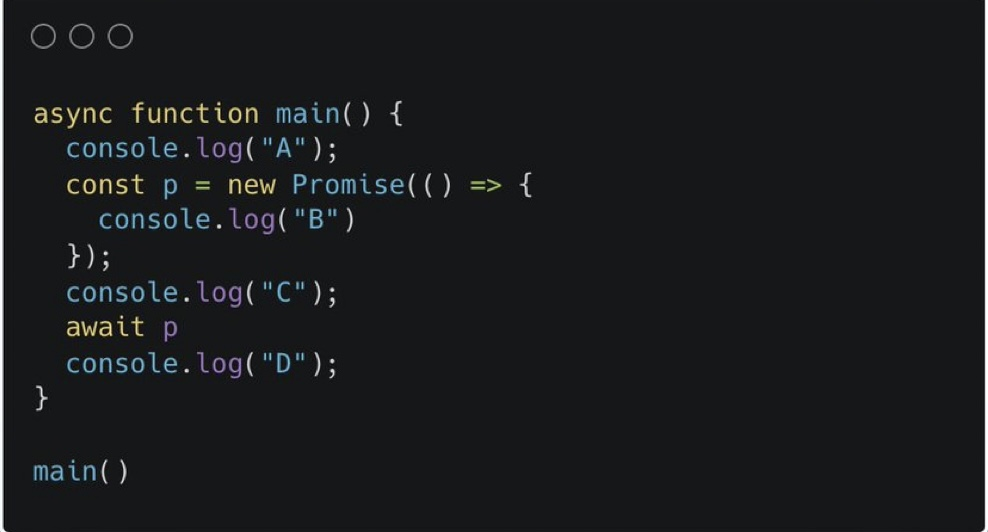
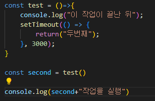
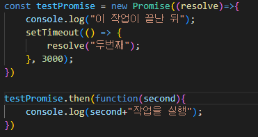
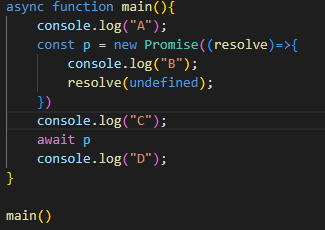

## 서론

일단 본론으로 들어가기전에 한가지 퀴즈를 풀어보자.  
위의 코드를 실행하면 결과가 어떻게 나올 것 같은가?  
다양한 대답이 나올 것이라고 예상이 되지만 Promise를 제대로 이해하지못했거나, 모르는 사람이라면 대부분 틀린 대답을 했을 것 이다.

우선 정답을 알려주면  
A  
B  
C  
이다.

결과가 납득이 가지 않는 사람이 매우 많을 것이라고 생각이 된다.  
나또한 이 문제를 처음보고 결과를 돌려봤을때 예상과 너무 다른 결과에 매우 흥분했었다.

위의 문제를 생각하고, 왜? 저런 결과가 나올까 하는 생각과 함께 이 글을 읽는다면 Promise에 대해 이해하는데 매우 도움이 될 것이다.

## Promise란?

Promise는 저번 게시글에서 말했던 JS의 비동기처리 방법 중 하나이다.  
new Promise 를 통해 새로운 Promise를 선언한 뒤 그 내부에 함수를 작성한다.
그 후 resolve와 reject를 통해 값을 반환 시키고 .then을 이용해 값 반환을 확인 한 후 새로운 로직을 실행하는 것이다.

위의 코드를 보자  
우리는 무슨 결과를 예상할 수 있는가?  
비동기에 대해서 이해하지못한 상태라면

이런 결과를 예상했겠지만

위의 코드는 이런 결과가 나온다.  
기본적으로 JS는 비동기의 언어이기 때문에 앞의 작업이 끝나지 않더라도 다음 작업으로 넘어간다.  
그렇기에 위의 test 함수에서 setTimeout으로 3초뒤 값을 반환시켜주기로했더라도 밑에서는 기다려주지않는다.  
그렇기때문에 second로 값이 반환되기전에 값을 출력해버려 undefined가 나온 것이다.

이런 상황을 해결하기 위해 나온 것이 Promise이다.

아까와 비슷한 코드지만 다른점이 있다면 함수가 아닌 Promise를 통해 처리했다.  
이 코드의 결과는 예상했듯이

다음과 같이 나온다.  
setTimeout을 통해 3초뒤 resolve로 값이 반환 되었다.  
그리고 값이 반환되기전 밑의 작업을 실행시키지 않고 기다렸다.  
이렇게 비동기의 상황에서 동기적으로 함수를 실행시키기 위한 것이 Promise이다.

여기서 중요한 것은 resolve로 값이 반환 되는 것을 기다린다는 것이다.

## 다시 위의 문제를 보자

이제는 이 코드의 문제가 무엇인지 보일 것이다.  
이 코드에 있는 Promise에는 resolve 나 reject 와 같이 이 작업이 처리되었다는 것을 알려줄 것들이 없다.  
그렇기때문에 await p 에서 흐름이 막혀 밑의 D를 출력하지 못한 것이다.

위의 코드처럼 undefinded 라도 resolve해준다면

이 처럼 우리가 예상한 결과가 나오게 된다.

## 마치며

오늘은 Promise에 대해서 알아봤다.  
요즘은 Promise를 대신한 async/await 을 많이 사용하지만, 이 또한 결국 promise를 사용하는 것들이기떄문에 Promise의 원리에 대해서 알아둔다면 많은 도움이 될 것이다.
