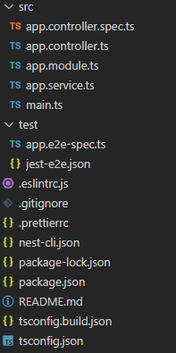
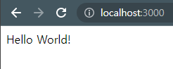

## 서론

이번 게시글부터 NestJS로 웹서버를 구축하는 과정을 여러 게시글로 나눠서 작성할 예정이다.  
오늘은 NodeJS에 NestJS 패키지를 설치하고 프로젝트를 생성하는 것까지 해볼 것이다.

## NestJS 설치

NestJS는 터미널 혹은 명령프롬포트에 아래와 같은 명령어를 입력해 설치할 수 있다.

> npm i -g @nestjs/cli

## NestJS 프로젝트 생성

아래와 같은 명령어를 입력해 새 프로젝트를 생성할 수 있다.

> nest new <프로젝트명>

프로젝트를 생성하면 아래와 같은 파일들이 생성될 것이다.

위의 파일중 우리가 알아야할 파일은 src 폴더 내부의 파일들이다.

> app.controller.spc.ts: 유닛 테스트를 위한 파일  
> app.controller.ts: 기본 Controller  
> app.module.ts: root 모듈을 정의  
> app.service.ts: 관련있는 기능들을 클래스에 분리해서 작성하고 사용 시 controller에 import해서 사용  
> main.ts: NestFactory instance를 생성하는 엔트리 파일

## 프로젝트 실행해보기

> npm run start:dev

위의 명령어를 이용해 서버를 실행하고 아래의 주소로 이동해보면 "Hello World" 가 출력되는 것을 알 수 있다.

> http://localhost:3000/

## 마치며

오늘은 NestJS를 설치, 새 프로젝트를 생성해보고 실행하는 것까지 해보았다.  
다음시간에는 NestJS를 이용해 다른 서비스를 만들어보는 것까지 해볼 예정이다.
