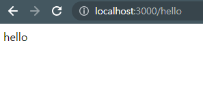

## 서론

저번 게시글에서는 NestJS를 설치하고 프로젝트를 생성하는 것까지 해보았다.  
이번시간에는 NestJS에서 어떻게 요청을 받고 요청을처리하여 응답하는지를 알아보자.

## Controller

저번시간에 생성한 NestJS 파일을 보면 \*.controller,ts 라는 파일이 있을 것이다.  
그 파일 내부를 보면 다음과 같은 구조로 되어있다.

> import { Controller, Get } from '@nestjs/common';  
> import { AppService } from './app.service';
>
> @Controller()  
> export class AppController {  
>  constructor(private readonly appService: AppService) {}
>
> @http메소드('주소')  
>  함수명(): string {  
>  return this.appService.서비스함수명();  
>  }  
> }

우리가 봐야할 부분은 아래 @http메소드 부터이다.  
http메소드로 우리는 get, post, delete 등을 사용한다.  
이를 적어주는 칸이 http메소드이다.

주소는 localhost:3000/ 뒤에 붙는 주소를 적는칸이다.  
/hello 라고 적어넣으면 localhost:3000/hello 에 접속하면 서버가 응답하게된다.

함수명은 클라이언트가 저 주소로 요청을 했을때 컨트롤러에서 실행할 함수의 이름이다.

서비스함수명은 Service 레이어에서 실행할 함수의 이름이다.  
\*.service.ts 파일에서 실행할 함수의 이름을 적어주면된다.

## Service

\*.service.ts 라는 파일을 들어가보자.

> 함수명(): string {  
>  return 응답할 값;  
> }

파일 내부의 아래를 보면 위와같은 코드를 볼 수 있다.

함수명은 controller 파일에서 적었던 서비스함수명과 동일하게 적으면된다.

응답할 값은 들어온 요청에대한 응답값이다.

응답이 들어오면 컨트롤러에서 주소에 따라 서비스 레이어에 있는 함수를 실행시켜 결과를 처리하고 처리한 값을 클라이언트에게 응답하는 구조이다.

## 예시

//controller

> @Get('/hello')  
>  함수명(): string {  
>  return this.appService.hello();  
>  }  
> }

//service

> hello(): string {  
>  return "hello";  
> }

위와같은 코드를 각각의 파일에 추가하여 작성한다음 실행하여 주소를 입력해보면 아래와 같은 값이 나오는 것을 알 수 있다.

## 마치며

오늘은 NestJS를 통해 주소와 응답값을 설정하는 것을 해보았다.  
NestJS의 구조에 대해서 이해하고나면 어렵지않게 할 수 있는 작업이니 NestJS의 구조를 이해하는데 시간을 쏟는 것이 좋을 것이다.
