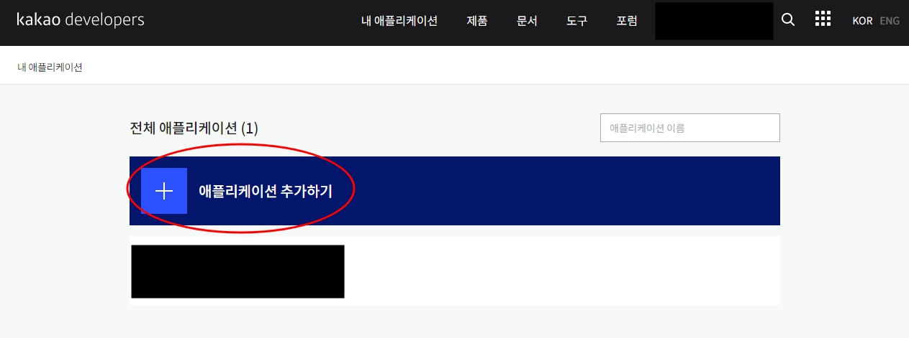
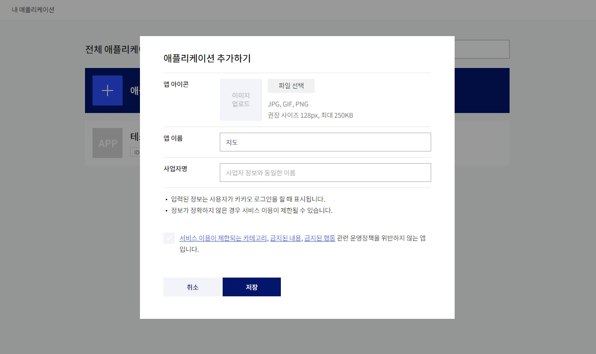
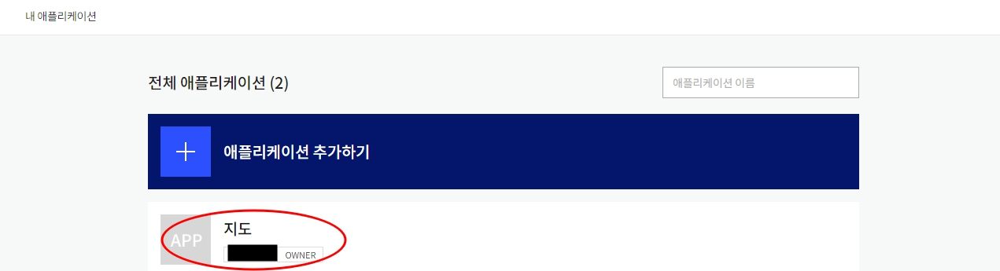
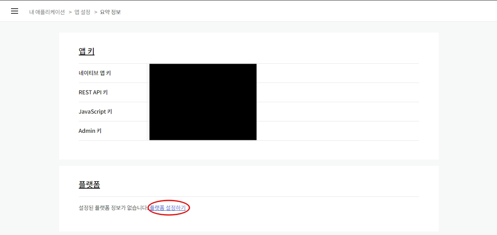
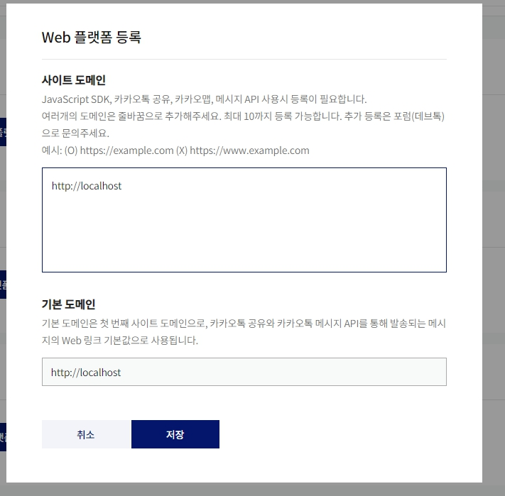

## 서론

웹 사이트를 사용하다보면 가끔 지도에 정보를 표시해놓은 것을 볼 수 있다.  
이는 다양한 지도 API를 이용해 구현한 것이다.  
구글, 네이버, 카카오 등 다양한 지도API가 있는데 카카오 API를 이용해서 웹상에 지도를 표시해보자.  

## API키 발급받기

카카오 지도를 이용하기 위해서는 카카오 API키를 발급받아야한다.  
밑의 카카오 개발 사이트에 접속하여 키를 발급받아보자.  

> https://developers.kakao.com/  

위의 사진에 표시한 부분으로 들어가보자.  

들어가서 애플리케이션 추가하기를 누르면 위와 같은 창이 나올 것이다.  
원하는 앱이름을 적고 사업자명을 적은 뒤 저장을 누르자.  

그럼 이렇게 앱이 만들어졌을 것이다.  

안으로 들어가면 네가지의 키가 있는데 이 키들이 API를 사용할 때 필요한 키이다.  
API를 사용하기전에 설정해야하는 부분이 추가로 있다.  
키 아래에 플랫폼 설정하기를 눌러보자.  

그럼 다음과 같이 여러가지 플랫폼이 나올텐데 본인이 사용할 플랫폼에 등록하면 된다.  
여기서는 웹을 사용할 것이기 때문에 웹에 등록하겠다.  

등록하기를 누르면 위와 같은 창이 나오고 본인이 사용할 도메인을 추가하면된다.  
테스트를 본인 컴퓨터에서 할 것이라면 위와 같이 추가하고, 추가적인 포트를 뒤에 적어주면된다.  
그게 아니라면 앱이 돌아가는 컴퓨터의 아이피와 포트를 적어주자.  

위의 작업을 하면 이제 API를 사용할 준비는 끝난 것이다.  

## 마치며

오늘은 API를 사용하기 위한 키를 발급받아봤다.  
다음 게시글에서는 카카오 API를 어떻게 웹페이지에 표시하는지 알아보겠다.  
