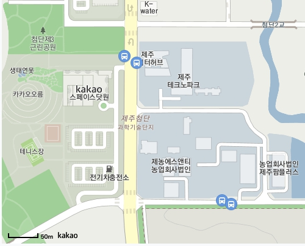

## 서론

저번 게시글에서는 API 키를 발급받아봤다.  
이제 이 API키를 이용해 지도를 웹상에 표시해보자.  

## 카카오지도

> https://apis.map.kakao.com/web/  

위의 주소는 지도 API에 대한 가이드와 샘플이 있는 사이트이다.  
오늘 게시글은 위 사이트의 가이드를 참고하여 작성하였다.  

본인이 표시할 웹 문서에 아래의 코드를 추가한다.  

```html
<div id="map" style="width:500px;height:400px;"></div>
```  

지도를 표시할 공간이다.  
스타일부분의 크기를 조정하면 지도의 크기를 조정할 수 있다.  

```html
<script type="text/javascript" src="//dapi.kakao.com/v2/maps/sdk.js?appkey=발급받은 APP KEY를 넣으시면 됩니다."></script>
```  

위의 코드를 추가로 입력한다.  
키를 넣는 부분에 저번 게시글에서 발급받은 키중 JavaScript 키를 대신 입력하면 된다.  

```javascript
const container = document.getElementById('map'); //지도를 담을 영역의 DOM 레퍼런스  
const options = { //지도를 생성할 때 필요한 기본 옵션  
	 center: new kakao.maps.LatLng(33.450701, 126.570667), //지도의 중심좌표.  
	 level: 3 //지도의 레벨(확대, 축소 정도)  
};  
const map = new kakao.maps.Map(container, options); //지도 생성 및 객체 리턴  
```

위의 코드는 웹 상에 지도를 표시하기 위한 코드이다.  
지도의 중심좌표는 처음 지도가 표시될 곳을 설정한다.  
지도의 레벨은 낮을 수록 확대되어나타나고 높을 수록 넓은 범위를 표시한다.  
본인이 필요한 정도에 따라서 설정하면 될 것이다.  

전체 코드를 정리하자면 이렇다.  

```html
<!DOCTYPE html>  
<html>  
<head>  
<meta charset="utf-8"/>  
	 <title>Kakao 지도 시작하기</title>  
</head>  
<body>  
	 <div id="map" style="width:500px;height:400px;"></div>  
	 <script type="text/javascript" src="//dapi.kakao.com/v2/maps/sdk.js?appkey=발급받은 APP KEY를 넣으시면 됩니다."></script>  
	 <script>  
		 const container = document.getElementById('map');  
		 const options = {  
			 center: new kakao.maps.LatLng(33.450701, 126.570667),  
			 level: 3  
		 };    
  
		 const map = new kakao.maps.Map(container, options);  
	 </script>  
</body>  
</html>
``` 

위와 같은 코드를 입력하면 아래와 같은 화면이 나올 것이다.  

<center></center>

## 마치며

오늘은 지도 API를 어떻게 웹상에 표시하는지 알아봤다.  
다음 게시글에서는 지도 API를 리액트를 통해 표시하는 법에 대해서 알아보겠다.  
