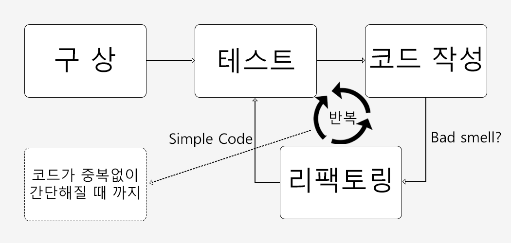
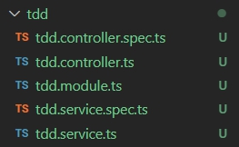
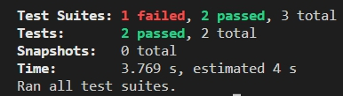
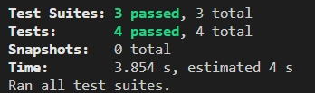

## 서론

저번 게시글에서는 TDD에 대해서 간단하게 알아보았다.  
이번에는 TDD 가 어떤 방식으로 진행되는지 자세하게 알아보자.  

## TDD의 진행 방식

<center></center>

위의 사진을 보며 아래의 설명을 이해하면 쉬울 것이다.  

일단 필요한 하나의 기능에 대해서 구상한다.  
여기서 하나의 기능이란 어플리케이션 전체를 의미하는 것이 아닌 필요한 기능 한개를 의미한다.  
그 기능만을 테스트 해볼 수 있는 코드를 작성하여 테스트 해본다.  
그리고 테스트 코드를 기반으로 실제 코드를 작성해보고 그 코드를 검토하며 리팩토링한다.  
그 리팩토링한 코드를 테스트해보고 더 이상 고칠부분이 없을 때까지 위의 과정을 반복한다.  

위의 과정을 거쳤다면 추가적인 기능에 대해서 구상하고 위의 과정을 반복한다.  

## TDD의 단계

위의 단계를 간단하게 3단계로 나눌 수 있다.  

### Red
최초로 테스트 코드를 작성한다.  
테스트 코드는 실패하고, 기능을 테스트를 통과할 수 있는 최소한의 코드로 재작성한다.  
이때 코드는 실제 코드가 아니기때문에 최대한 빠르게 기능을 구현하는데 초점을 두고 작성한다.  

### Green
작성한 테스트 코드가 정상적으로 작동하여 테스트를 통과한 상태이다.  

### Refactor
테스트 코드를 정리하고, 중복 코드를 제거하는 과정을 거친다.  
충분하다고 생각될 때까지 리팩토링을 반복한다.  

## TDD의 예

NestJS의 Jest를 이용해 TDD가 어떻게 이루어지는지 간단하게 알아보자.  
일단 Nest 프로젝트를 하나 새로만든다.  
그리고 아래의 명령어들을 입력한다.  

```
nest g mo tdd
nest g co tdd
nest g s tdd
```

그럼 이제 아래와 같이 파일들이 생성됐을 것이다.

<center></center>

여기서 tdd.service.spec.ts 파일을 열어보자.  

```typescript
import { Test, TestingModule } from '@nestjs/testing';
import { TddService } from './tdd.service';

describe('TddService', () => {
  let service: TddService;

  beforeEach(async () => {
    const module: TestingModule = await Test.createTestingModule({
      providers: [TddService],
    }).compile();

    service = module.get<TddService>(TddService);
  });

  it('should be defined', () => {
    expect(service).toBeDefined();
  });
});
```

describe 안에 아래의 코드를 추가해보자.  
expect는 기대하고 있다는 의미로 toEqual(10) 이 붙으면 result 가 10 이어야한다는 것을 의미한다.  

```typescript
  it('should be 10', () => {
    const result = service.getNumber();
    expect(result).toEqual(10);
  });
```

그리고 아래의 명령어를 입력해보자.  

```
npm test
```

<center></center>

그럼 위와 같은 결과가 나오며 당연히 실패했다고 나올 것이다.  
왜냐하면 우리는 아직 코드를 작성하지 않았기 때문이다.  

그럼 이제 tdd.service.ts 파일을 열어보자.  
그리고 아래의 코드를 추가하자.  

```typescript
  getNumber(): number {
    let result = 0;
    result += 5
    result += 3
    result += 2
    return result;
  }
```

그리고 다시 테스트 명령어를 입력해보자.  

<center></center>

그럼 이번에는 테스트에 통과했다고 나올 것이다.  

그리고 이 테스트 코드를 다시 리팩토링해보자.  

중복되고 필요없는 코드를 걸러내고 적으면 아래와 같이 적을 수 있을 것이다.  

```typescript
  getNumber(): number {
    const result = 5 + 3 + 2;
    return result;
  }
```

그리고 다시 테스트를 해보고 통과했다면 또 다른 기능을 만들어 테스트를 진행하면 된다.  

예로든 코드는 너무 간단하여 테스트를 진행하는게 손해라고 생각할 수도 있지만, 복잡한 코드를 작성해야할 때는 도움이 될 것이다.  

## 마치며

오늘은 TDD의 진행방식과 NestJS에서 Jest를 이용해 어떻게 테스트를 진행하는지 알아보았다.  
실제 코드를 작성할 때 단위 테스트를 적용하면 번거롭다 느낄 수 있지만 결과물이 깔끔하게 나오는데 도움이 될 것이다.  
