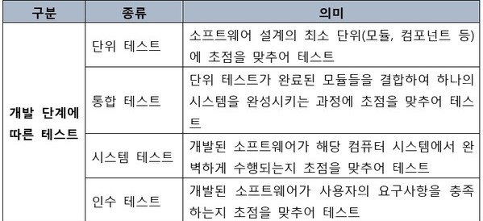

## 서론
  

  

코드를 테스트할 때 여러가지 기준으로 테스트를 할 수 있다.  
전체적인 모듈들의 호환성을 확인하기 위한 통합테스트(Integration Test)  
개발된 소프트웨어가 해당 컴퓨터 시스템에서 완벽하게 수행되는지 초점을 맞추어 테스트하는 시스템 테스트(System Test)  
소프트웨어가 사용자의 요구사항을 충족하는지를 테스트하는 인수테스트(Acceptance Test)  
그리고 오늘 게시글에서 다룰 개념은 기능이 제대로 돌아가는지 확인하기위한 단위테스트(Unit Test) 이다.  

## 단위 테스트?
  

  

### Unit Test

위에서 설명한대로 전체적인 어플리케이션이 아닌 하나의 기능만을 테스트하기 위해 어떤 부분을 단위로 나눠 독립적으로 테스트를 진행하는 방식이다.  
저번 게시글에서 설명했던 TDD에서 사용하는 테스트 방식을 의미한다.  

## 왜 사용해야할까?  

테스트를 통합 테스트 방식으로 진행하면 한번 테스트할때마다 어플리케이션 전체를 테스트 해야한다.  
그러면 테스트를 진행하는데 발생하는 비용이 상당히 커진다.  

반면에 단위 테스트는 테스트해야하는 기능만 독립적으로 테스트하기 때문에 통합테스트와 비교하여 발생하는 비용이 줄어든다.  
또한 테스트한 부분만 리팩토링하고 수정하면 되기때문에 문제가 발생했을때 해결하기가 수월하다.  

또한 통합 테스트는 어플리케이션 전체를 완성해야만 테스트가 가능하다.  
하지만 단위 테스트는 어플리케이션 개발 도중에도 새로운 기능을 만들 때 마다 테스트를 할 수 있기때문에 어플리케이션을 완성한 뒤 오류가 발생할 확률이 줄어든다.  

그리고 단위 테스트를 개발 도중에 계속 해나간다면 그 테스트 코드 자체가 코드에 대한 문서가 될 수 있어 유지보수에 유리하다.  

정리해보자면  

1. 테스트를 할때 발생하는 비용이 줄어든다.  
2. 테스트를 위해 어플리케이션 전체를 완성할 필요가 없어 빠르게 테스트를 해볼 수 있다.  
3. 새로운 기능을 추가할 때도 수시로 테스트를 할 수 있다.  
4. 테스트 코드 자체가 코드에 대한 기록과 문서가 될 수 있다.  

## 꼭 좋기만 할까?

이렇게나 많은 장점을 가진 단위 테스트지만 통합 테스트와 비교하여 꼭 좋은 점만 존재할까?  
단위 테스트는 많은 장점을 가졌지만 단점도 몇가지 가지고 있다.  

기본적으로 어플리케이션의 기능들은 하나의 모듈로만 돌아가지 않는다.  
그렇기때문에 다른 모듈로 부터 데이터를 받아온다거나, 데이터를 보내야할 때 이를 테스트하기 위해 번거로운 과정이 필요하다.  
이를 테스트하려면 가짜 객체(Mock Object)를 만들어 테스트에 사용해야한다.  

또한 TDD에서도 언급한 단점이지만 꼭 테스트를 진행하지 않아도 되는 간단한 기능들 조차도 테스트를 진행한다면 비용이 추가적으로 발생할 수 있다.  
그리고 개발을 하는 동시에 테스트를 진행해야하기때문에 개발 시간이 늘어나며, 개발 방식도 단위테스트에 맞게 개발을 해야하기때문에 익숙해지기전까지는 어려울 수 있다.  

## 마치며

오늘은 단위 테스트에 대해서 알아보았다.  
TDD에서 사용하는 방식인 단위 테스트는 잘 다룬다면 도움이 되겠지만 미숙하다면 오히려 시간이 오래 걸릴 수도 있을 것 같다.  
그렇기에 더 많이 공부하고 상황에 맞게 테스트 방식을 정하는 자세가 필요할 것 같다.  