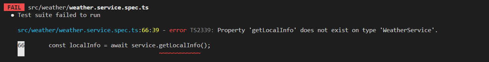
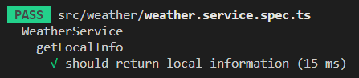

## 서론

오늘은 그 동안 공부해본 TDD를 nestJS의 Jest를 이용해 직접해보려고한다.  
시작하기전 TDD에 대한 내용을 복습하고가자.  

## TDD 과정

TDD는 크게 7단계를 거친다.  

1. 기능 요구사항 및 스팩 작성  

2. 테스트 코드 작성  

3. 테스트 실패 확인  

4. 코드 작성  

5. 테스트 통과 확인  

6. 리팩토링  

7. 2~6단계 반복  

오늘은 위의 단계를 거칠 예정이다.  

## 1단계 : 기능 요구사항 및 스팩 작성

이 단계에서는 구현하려는 기능의 요구사항과 스팩을 작성한다.  
오늘 구현하려는 기능은 내가 개발중인 프로젝트에서 가장 간단한 기능인 "지역 정보 요청" 이다.  

해당 기능은 다음과 같은 요구사항과 스팩을 구현해야한다.  

1. 데이터베이스에서 지역정보를 받아 반환하는 "getLocalInfo" 메서드를 구현해야한다.  

2. "getLocalInfo" 는 지역정보를 반환해야한다.  

3. 지역정보는 [id, area_code, county, city, grid_x, grid_y, longitude, latitude] 위의 데이터 테이블을 포함한 객체리스트이다.  

## 2단계 : 테스트 코드 작성

해당 기능을 구현하기 위한 테스트 코드에는 무엇이 필요할지 생각해보자.  

1. 반환값이 올바른지 테스트하기위한 예시 반환값.  

2. 데이터베이스 없이 테스트코드를 돌리기위한 데이터베이스 객체의 메소드의 mocking.  

3. mocking 된 메소드가 제대로 호출되었는지 검증.  

위의 사항들을 바탕으로 테스트 코드를 작성해보면 아래와 같다.  

```typescript
import { Test, TestingModule } from '@nestjs/testing';
import { WeatherService } from './weather.service';
import { Repository } from 'typeorm';
import { localEntity } from '../entities/local.entity';
import { getRepositoryToken } from '@nestjs/typeorm';

describe('WeatherService', () => {
  let service: WeatherService;
  let localRepository: Repository<localEntity>;

  beforeEach(async () => {
    const module: TestingModule = await Test.createTestingModule({
      providers: [
        WeatherService,
        {
          provide: getRepositoryToken(localEntity),
          useValue: {
            find: jest.fn(),
          },
        },
      ],
    }).compile();

    service = module.get<WeatherService>(WeatherService);
    localRepository = module.get<Repository<localEntity>>(
      getRepositoryToken(localEntity),
    );
  });

  describe('getLocalInfo', () => {
    it('should return local information', async () => {
      const returnLocalInfo: localEntity[] = [
        {
          id: 1,
          area_code: 11,
          county: '서울',
          city: '종로구',
          grid_x: 60,
          grid_y: 127,
          longitude: 37.5720164,
          latitude: 126.9794068,
        },
        {
          id: 2,
          area_code: 12,
          county: '서울',
          city: '중구',
          grid_x: 62,
          grid_y: 125,
          longitude: 37.563656,
          latitude: 126.9972477,
        },
        {
          id: 3,
          area_code: 13,
          county: '서울',
          city: '용산구',
          grid_x: 59,
          grid_y: 128,
          longitude: 37.5327686,
          latitude: 126.9903127,
        },
      ];
      jest.spyOn(localRepository, 'find').mockResolvedValue(returnLocalInfo);

      const getlocalInfo = await service.getLocalInfo();

      expect(getlocalInfo).toEqual(returnLocalInfo);
      expect(localRepository.find).toHaveBeenCalled();
    });
  });
});
```

자세하게 설명을 하자면 테스트 코드의 beforeEach 함수에서 테스트를 위한 모듈을 생성한다.  
WeatherService 클래스에서 사용하는 Repository 객체를 mock으로 생성한다.  
mock 으로 생성한 Repository를 각종 메소드를 테스트하는데 사용할 것이다.  

아래의 테스트코드는 'getLocalInfo' 메소드를 테스트하는 코드이다.  
localRepositroy 객체의 find 함수를 mock으로 설정한다.  
이를 통해 해당 메소드에서 반환값이 올바른지 검증하는 테스트코드이다.  

## 3단계 : 테스트 실패 확인

<center></center>

당연하게도 위의 테스트 코드에 대응하는 실제코드가 없기때문에 테스트는 실패하게 된다.  
이제 실제 코드를 작성해보자.  

## 4단계 : 코드 작성

```typescript
import { Injectable, Logger } from '@nestjs/common';
import { InjectRepository } from '@nestjs/typeorm';
import { localEntity } from '../entities/local.entity';
import { Repository } from 'typeorm/index';

@Injectable()
export class WeatherService {
    constructor(
    @InjectRepository(localEntity)
    private localRepository: Repository<localEntity>,
  ) {}

  async getLocalInfo(): Promise<localEntity[]> {
    try {
      const data = await this.localRepository.find();
      return data;
    } catch(err) {
      throw err;
    }
  }
}
```

위의 코드는 typeOrm의 localRepository 객체의 find() 메소드에서 지역정보를 받아와 사용자에게 반환하는 코드이다.  
오류가 발생하면 err 코드를 throw 한다.  

## 5단계 : 테스트 통과 확인

위의 코드를 작성하고 테스트를 돌려보자.  

<center></center>

테스트를 통과했다.  
이제 해당 코드를 검수하고 리팩토링하는 과정이 남았다.  

## 6단계 : 리팩토링

위의 코드에서 리팩토링할 필요를 발견하지 못했기때문에 필자는 6단계를 스킵하겠다.  

## 7단계 : 2~6 단계 반복

이미 1단계에서 작성했던 요구사항과 스팩을 만족했기때문에 더 이상 반복할 필요성을 찾지 못했기때문에 7단계도 스킵하겠다.  

## 마치며

오늘은 Jest를 이용해 직접 TDD로 코드를 작성하는 과정을 거쳐보았다.  
다음 게시글에서는 오늘 구현한 기능에 이어서 조금 더 복잡한 기능을 TDD로 구현해보겠다.  