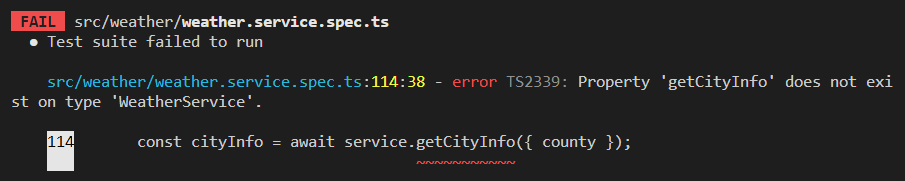
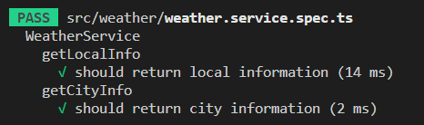

## 서론

지난 게시글에서는 Jest를 이용해 실제로 TDD 개발 과정을 알아봤다.  
이번에는 지난번에 개발한 코드에 새로운 기능을 추가하는 과정을 알아보자.  

## 1단계 : 기능 요구사항 및 스팩 작성

새로운 기능을 추가하려면 그 기능의 요구사항과 스팩에 대해서 작성해야한다.  
이번에 추가할 기능은 '서울', '경상남도' 와 같이 특정 시/도의 지역정보를 반환하는 기능이다.  

위의 기능을 구현하기 위해서는 아래의 요구사항과 스팩을 충족해야한다.  

1. 클라이언트에게 county와 함께 요청을 받으면 해당 county에 속하는 city를 반환하는 'getCityInfo'를 구현해야한다.  

2. 클라이언트에게 받는 county 값은 문자열 객체로 {county : "서울"} 과 같은 형태를 가진다.  

3. 'getCityInfo' 는 해당 county 값을 가진 지역정보를 데이터베이스에서 찾아 객체배열 형태로 반환한다.  

4. 반환하는 객체배열 형태는 [id, area_code, county, city, grid_x, grid_y, longitude, latitude] 로 되어있다.  

## 2단계 : 테스트 코드 작성

이번 테스트 코드는 지난 게시글에서 썼던 코드에 추가로 작성할 것이다.  

일단 'getCityInfo' 라는 메소드를 테스트하기위해 필요한 부분에 대해서 생각해보자.  

1. 클라이언트에게 요청받은 예시 county 값  

2. 반환값이 올바른지 테스트하기위한 예시 반환값  

3. 데이터베이스 없이 테스트하기위한 데이터베이스 객체의 메소드 mocking  

4. mocking된 메소드가 호출되었는지 증명하기 위한 코드

위의 사항을 바탕으로 테스트 코드를 작성해보면 아래와 같다.  

```typescript
  describe('getCityInfo', () => {
    it('should return city information', async () => {
      const county = '서울';
      const returnCityInfo: localEntity[] = [
        {
          id: 1,
          area_code: 11,
          county: '서울',
          city: '종로구',
          grid_x: 60,
          grid_y: 127,
          longitude: 37.5720164,
          latitude: 126.9794068,
        },
        {
          id: 2,
          area_code: 12,
          county: '서울',
          city: '중구',
          grid_x: 62,
          grid_y: 125,
          longitude: 37.563656,
          latitude: 126.9972477,
        },
        {
          id: 3,
          area_code: 13,
          county: '서울',
          city: '용산구',
          grid_x: 59,
          grid_y: 128,
          longitude: 37.5327686,
          latitude: 126.9903127,
        },
      ];
      jest.spyOn(localRepository, 'createQueryBuilder').mockReturnValue({
        where: jest.fn().mockReturnThis(),
        getRawMany: jest.fn().mockResolvedValue(returnCityInfo),
      } as unknown as SelectQueryBuilder<localEntity>);

      const getcityInfo = await service.getCityInfo({ county });

      expect(getcityInfo).toEqual(returnCityInfo);
      expect(localRepository.createQueryBuilder).toHaveBeenCalled();
    });
  });
```

위의 코드를 자세하게 설명해보겠다.  
일단 클라이언트에게 요청받았다는 가정하에 요청받은값을 '서울'로 설정한다.  
그리고 값이 제대로 반환되는지 확인하기위해 예시 반환값을 설정한다.  

typeOrm의 createQueryBuilder를 이용해 데이터를 받아올 예정이므로 사용이 예상되는 메소드들을 mocking 한다.  
반환된 값이 예상한값과 같은지를 확인하고 데이터베이스 객체의 메소드가 제대로 호출되었는지 확인한다.  

위의 작성한 테스트 코드를 저번 게시글의 테스트 코드에 추가하면 아래와 같다.  

```typescript
import { Test, TestingModule } from '@nestjs/testing';
import { WeatherService } from './weather.service';
import { Repository, SelectQueryBuilder } from 'typeorm';
import { localEntity } from '../entities/local.entity';
import { getRepositoryToken } from '@nestjs/typeorm';

describe('WeatherService', () => {
  let service: WeatherService;
  let localRepository: Repository<localEntity>;

  beforeEach(async () => {
    const module: TestingModule = await Test.createTestingModule({
      providers: [
        WeatherService,
        {
          provide: getRepositoryToken(localEntity),
          useValue: {
            find: jest.fn(),
            createQueryBuilder: jest.fn(),
          },
        },
      ],
    }).compile();

    service = module.get<WeatherService>(WeatherService);
    localRepository = module.get<Repository<localEntity>>(
      getRepositoryToken(localEntity),
    );
  });

  describe('getLocalInfo', () => {
    it('should return local information', async () => {
      const returnLocalInfo: localEntity[] = [
        {
          id: 1,
          area_code: 11,
          county: '서울',
          city: '종로구',
          grid_x: 60,
          grid_y: 127,
          longitude: 37.5720164,
          latitude: 126.9794068,
        },
        {
          id: 2,
          area_code: 12,
          county: '서울',
          city: '중구',
          grid_x: 62,
          grid_y: 125,
          longitude: 37.563656,
          latitude: 126.9972477,
        },
        {
          id: 3,
          area_code: 13,
          county: '서울',
          city: '용산구',
          grid_x: 59,
          grid_y: 128,
          longitude: 37.5327686,
          latitude: 126.9903127,
        },
      ];
      jest.spyOn(localRepository, 'find').mockResolvedValue(returnLocalInfo);

      const getlocalInfo = await service.getLocalInfo();

      expect(getlocalInfo).toEqual(returnLocalInfo);
      expect(localRepository.find).toHaveBeenCalled();
    });
  });

  describe('getCityInfo', () => {
    it('should return city information', async () => {
      const county = '서울';
      const returnCityInfo: localEntity[] = [
        {
          id: 1,
          area_code: 11,
          county: '서울',
          city: '종로구',
          grid_x: 60,
          grid_y: 127,
          longitude: 37.5720164,
          latitude: 126.9794068,
        },
        {
          id: 2,
          area_code: 12,
          county: '서울',
          city: '중구',
          grid_x: 62,
          grid_y: 125,
          longitude: 37.563656,
          latitude: 126.9972477,
        },
        {
          id: 3,
          area_code: 13,
          county: '서울',
          city: '용산구',
          grid_x: 59,
          grid_y: 128,
          longitude: 37.5327686,
          latitude: 126.9903127,
        },
      ];
      jest.spyOn(localRepository, 'createQueryBuilder').mockReturnValue({
        where: jest.fn().mockReturnThis(),
        getRawMany: jest.fn().mockResolvedValue(returnCityInfo),
      } as unknown as SelectQueryBuilder<localEntity>);

      const getcityInfo = await service.getCityInfo({ county });

      expect(getcityInfo).toEqual(returnCityInfo);
      expect(localRepository.createQueryBuilder).toHaveBeenCalled();
    });
  });
});
```

## 3단계 : 테스트 실패 확인

<center></center>

당연히 실제 코드가 없기때문에 실패한다.  
위의 테스트 코드를 바탕으로 실제코드를 작성해보자.  

## 4단계 : 코드 작성

코드 작성에 앞서 사용해야하는 메소드는 아래와 같다.  

1. localRepository 객체의 createQueryBuilder 메소드  

2. typeOrm의 쿼리빌더인 createQueryBuilder 의 where, getRawMany 메소드  

테스트 코드와 위의 메소드를 참고하여 코드를 작성하면 아래와 같다.  

```typescript
  async getCityInfo(localDto: LocalDto): Promise<localEntity[]> {
    try {
      const cityInfo = await this.localRepository
        .createQueryBuilder()
        .where('county IN (:county)', { county: localDto.county })
        .getRawMany<localEntity>();
      return cityInfo;
    } catch (err) {
      throw err;
    }
  }
```

위 코드는 localDto를 이용해 클라이언트로부터 요청받은 데이터를 가져온다.  
그리고 typeOrm에서 지원하는 쿼리빌더인 createQueryBuilder 메소드를 호출한다.  
where 메서드를 이용해 'county' 컬럼에서 localDto의 county 값을 포함하는 도시들을 선택한다.  
getRawMany 메서드를 이용해 쿼리를 실행하고 결과를 가져와 cityInfo 변수에 값을 할당한다.  
이 cityInfo 값을 반환한다.  

코드 실행 중 오류가 발생하면 catch 블록으로 이동해 err 값을 throw한다.  

## 5단계 : 테스트 통과 확인

<center></center>

테스트를 깔끔하게 통과했다.  

## 6단계 : 리팩토링

위의 코드에서 리팩토링할 필요를 발견하지 못했기때문에 필자는 6단계를 스킵하겠다.  

## 7단계 : 2~6 단계 반복

이미 1단계에서 작성했던 요구사항과 스팩을 만족했기때문에 더 이상 반복할 필요성을 찾지 못했기때문에 7단계도 스킵하겠다.  

## 마치며

이번 게시글에서도 이어서 TDD를 통한 개발과정을 알아봤다.  
하나의 프로젝트를 TDD를 통해 완성하는 과정을 계속해서 블로그에 포스팅할 예정이다.  

