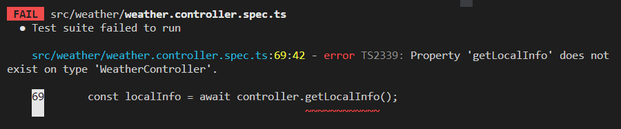
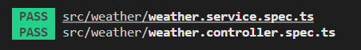

## 서론

지난 게시글까지는 서비스 레이어의 코드들을 테스트해보았다.  
이번에는 지금까지 만든 서비스 레이어를 호출하는 컨트롤러 레이어를 테스트해보자.  

## 1단계 : 기능 요구사항 및 스팩 작성

컨트롤러 레이어에서 요구하는 것은 몇가지 없다.  
일단 서비스 레이어가 원하는대로 잘 호출되는지 테스트하는 것이 기본이다.  
그리고 클라이언트가 주는 데이터가 DTO에 제대로 담기는지 테스트해야한다.  

위의 사항들을 참고하여 요구사항 및 스팩을 작성해보자.  

1. 서비스 레이어의 'getLocalInfo' 를 호출하는 'getLocalInfo' 메소드를 구현해야한다.  

2. 'getLocalInfo' 함수는 서비스레이어의 'getLocalInfo'가 반환하는 값을 반환해야한다.  

## 2단계 : 테스트 코드 작성

위의 요구사항 및 스팩을 바탕으로 테스트 코드를 작성해보자.  

우선 컨트롤러를 테스트하기 위한 모듈을 갖춰야한다.  

```typescript
import { Test, TestingModule } from '@nestjs/testing';
import { WeatherController } from './weather.controller';
import { WeatherService } from './weather.service';
import { Repository } from 'typeorm';
import { localEntity } from '../entities/local.entity';
import { getRepositoryToken } from '@nestjs/typeorm';

describe('WeatherService', () => {
  let controller: WeatherController;
  let service: WeatherService;
  let localRepository: Repository<localEntity>;

  beforeEach(async () => {
    const module: TestingModule = await Test.createTestingModule({
      controllers: [WeatherController],
      providers: [
        WeatherService,
        {
          provide: getRepositoryToken(localEntity),
          useValue: {},
        },
      ],
    }).compile();

    controller = module.get<WeatherController>(WeatherController);
    service = module.get<WeatherService>(WeatherService);
    localRepository = module.get<Repository<localEntity>>(
      getRepositoryToken(localEntity),
    );
  });
...
```

위에서는 'WeatherController' 와 'WeatherService' 를 컨트롤러와 서비스로 가지는 테스트 모듈을 만들어 이를 테스트에 활용할 수 있게 할당하는 과정을 거쳤다.  
또한 서비스레이어에서 localEntity 형태를 사용하기위해 Repository 를 만들어야하기때문에 localRepository 또한 할당했다.  
이를 모듈을 이용해 테스트를 진행할 예정이다.  

그 다음으로는 실제 테스트 코드를 만들어보자.  

우선 실제 컨트롤러 레이어의 코드는 서비스 레이어에 의존하고 있기때문에 서비스 레이어의 비지니스 로직을 Mocking 해주는 작업이 필요하다.  
또한 Mocking한 서비스레이어의 값과 컨트롤러 레이어의 값이 같은지를 확인하는 테스트 또한 해야한다.  

```typescript
describe('getLocalInfo', async () => {
    const returnLocalInfo = [
      {
        id: 1,
        area_code: 11,
        county: '서울',
        city: '종로구',
        grid_x: 60,
        grid_y: 127,
        longitude: 37.5720164,
        latitude: 126.9794068,
      },
      {
        id: 2,
        area_code: 12,
        county: '서울',
        city: '중구',
        grid_x: 62,
        grid_y: 125,
        longitude: 37.563656,
        latitude: 126.9972477,
      },
      {
        id: 3,
        area_code: 13,
        county: '서울',
        city: '용산구',
        grid_x: 59,
        grid_y: 128,
        longitude: 37.5327686,
        latitude: 126.9903127,
      },
    ];

    jest.spyOn(service, 'getLocalInfo').mockResolvedValue(returnLocalInfo);

    const getlocalInfo = await controller.getLocalInfo();

    expect(getlocalInfo).toEqual(returnLocalInfo);
    expect(service.getLocalInfo).toHaveBeenCalled();
  });
```
우선 앞의 서비스레이어를 테스트할 때 사용한 예시 지역값을 반환하도록 service 레이어의 'getLocalInfo'를 mocking 해준다.  
그리고 getLocalInfo 를 호출하여 예시 지역값을 반환하는지 확인한다.  
또한 서비스레이어의 getLocalinfo 메소드가 호출되었는지 테스트한다.  

## 3단계 : 테스트 실패 확인

<center></center>

실제 코드가 작성되지 않았으니 테스트는 실패한다.  

## 4단계 : 코드 작성

이제 위의 테스트 코드가 성공할 수 있도록 컨트롤러 레이어에 코드를 작성해보자.  

```typescript
import { Controller } from '@nestjs/common';
import { Get } from '@nestjs/common';
import { localEntity } from '../entities/local.entity';
import { WeatherService } from './weather.service';

@Controller('weather')
export class WeatherController {
  constructor(private weatherService: WeatherService) {
    this.weatherService = weatherService;
  }

  @Get('/all')
  async getLocalInfo(): Promise<localEntity[]> {
    return await this.weatherService.getLocalInfo();
  }
}
```

컨트롤러 레이어의 기본적인 구성을 갖춘 뒤에 getLocalInfo 메소드를 작성한다.  
getLocalInfo 메소드는 Promise 형태의 localEntity[] 를 반환하는 형태이다.  
내부코드는 비동기방식으로 weatherService 에서 getLocalInfo 메소드를 호출하고 그 값을 반환하는 형태로 작성했다.  

## 5단계 : 테스트 통과 확인

<center></center>

테스트를 통과했다.  

## 6단계 : 리팩토링

코드를 보니 실제코드부분에서 값을 바로 반환하는 것이 아니라 변수에 할당 후 반환하는 방식이 조금 더 괜찮아 보여서 이 부분을 보완해봤다.  

```typescript
import { Controller } from '@nestjs/common';
import { Get } from '@nestjs/common';
import { localEntity } from '../entities/local.entity';
import { WeatherService } from './weather.service';

@Controller('weather')
export class WeatherController {
  constructor(private weatherService: WeatherService) {
    this.weatherService = weatherService;
  }

  @Get('/all')
  async getLocalInfo(): Promise<localEntity[]> {
    const localInfo: localEntity[] = await this.weatherService.getLocalInfo();
    return localInfo;
  }
}
```

위처럼 리팩토링 한 후 다시 테스트를 해보자.  

<center></center>

테스트를 통과했다.  

## 7단계 : 2~6 단계 반복

이미 1단계에서 작성했던 요구사항과 스팩을 만족했기때문에 더 이상 반복할 필요성을 찾지 못했기때문에 7단계도 스킵하겠다.  

## 마치며

오늘은 컨트롤러 레이어를 테스트 해봤다.  
TDD 를 접한지 얼마되지않아 내가 하는 방식이 맞는지 확신을 가지지는 못하겠지만 계속 공부하고 알아가며 개선하는 것이 중요할 것 같다.  