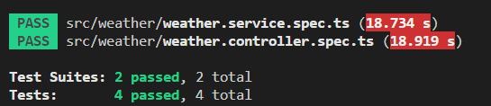

## 서론

저번 게시글까지는 지역정보에 관련된 기능을 만들어왔다.  
하지만 기능 테스트를 성공했을때만 테스트 했을 뿐 실패했을 때는 테스트하지 못하였다.  
오늘은 데이터베이스가 실패했을때의 상황을 어떻게 테스트해야하는지를 알아보자.  

## 1단계 : 기능 요구사항 및 스팩 작성

오늘 기능의 요구사항 및 스팩은 아래와 같다.  

1. 클라이언트로부터 county 값을 요청받으면 지역정보를 반환하는 'getCityInfo' 메소드에서 데이터베이스가 오류를 발생했을 때를 가정한다.  

2. createQueryBuilder 객체의 getRawMany 메소드에서 예외가 발생하게 한다.  

3. 'getCityInfo' 함수 호출 시 발생하는 에러가 'Database query error' 와 같은 에러 메세지인지 확인한다.  

## 2단계 : 테스트 코드 작성

우선 저번에 작성한 코드를 가져와서 테스트 할 것이기때문에 3단계와 4단계는 스킵한다.  

테스트 코드를 작성하기 위해서는 저번에 작성한 코드를 참고해보자.  

```typescript
  async getCityInfo(localDto: LocalDto): Promise<localEntity[]> {
    try {
      const cityInfo = await this.localRepository
        .createQueryBuilder()
        .where('county IN (:county)', { county: localDto.county })
        .getRawMany<localEntity>();
      return cityInfo;
    } catch (err) {
      throw err;
    }
  }
```

위의 코드에서 getRawMany를 호출했을때 예외가 발생하도록 해야한다.  
이를 생각하면서 Mocking 해보자.  

```typescript
  it('should throw error when database error', async () => {
      jest.spyOn(localRepository, 'createQueryBuilder').mockReturnValue({
        where: jest.fn().mockReturnThis(),
        getRawMany: jest
          .fn()
          .mockRejectedValue(new Error('Database query error')),
      } as unknown as SelectQueryBuilder<localEntity>);
  });
```

우선 저번에 작성한 것처럼 createQueryBuilder 메소드를 Mock 한다.  
그 객체의 where 과 getRawMany를 jest.fn 를 이용해 Mock 한다.  
하지만 이번에는 getRawMany에서 'Database query error' 라는 에러를 throw 하도록 한다.  

또한 이 에러메세지가 제대로 발생하는지 를 테스트하는 코드를 작성해야한다.  

```typescript
await expect(service.getCityInfo({ county: 'Seoul' })).rejects.toThrow(
  new Error('Database query error'),
);
```

위의 코드는 'getCityInfo' 를 호출하고 그 매개변수로 { county : 'Seoul' } 객체를 가진다.  
그리고 rejects.toThrow(new Error('Database query error')) 을 이용해 'getCityInfo' 에서 오류가 발생하는지 확인하고, 발생한 오류가 'Database query error' 인지 테스트한다.  

위의 테스트 코드를 하나로 적으면 아래와 같다.  

```typescript
  it('should throw error when database error', async () => {
      jest.spyOn(localRepository, 'createQueryBuilder').mockReturnValue({
        where: jest.fn().mockReturnThis(),
        getRawMany: jest
          .fn()
          .mockRejectedValue(new Error('Database query error')),
      } as unknown as SelectQueryBuilder<localEntity>);
      await expect(service.getCityInfo({ county: 'Seoul' })).rejects.toThrow(
        new Error('Database query error'),
      );
  });
```

## 3단계 ~ 4단계

이미 작성된 코드로 테스트를 진행하니 3단계, 4단계는 패스하겠다.  

## 5단계 : 테스트 통과 확인

<center></center>

테스트를 통과했다.  

## 6단계 : 리팩토링

리팩토링할 부분을 찾지 못하였으니 6단계는 패스하겠다.  

## 7단계 : 2~6 단계 반복

기능의 요구사항과 스팩을 만족했으니 7단계도 스킵하겠다.  

## 마치며

오늘은 성공한 테스트뿐만 아니라 실패했을때 어떤 에러가 발생하는지 테스트를 해보았다.  
이제 다음 게시글부터는 날씨 관련된 기능을 테스트해보며 만들어보자.  