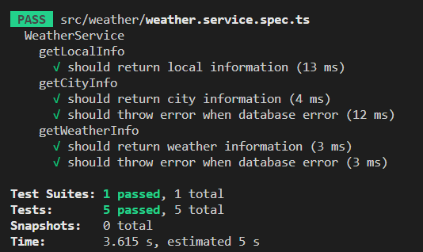

## 서론

오늘은 날씨 관련된 기능 하나를 TDD 방식으로 만들어보자.  

## 1단계 : 기능의 요구사항 및 스팩

날씨 정보를 받아오는 가장 기본적인 기능은 지역정보를 객체로 받고 그 요청에 맞는 정보를 찾아 응답하는 것이다.  
이를 수행하기위한 서비스레이어의 비지니스 로직이 가져야할 요구사항 및 스팩은 아래와 같다.  

1. 클라이언트로 부터 date(날짜), time(시간), area(지역코드) 를 객체로 받고 데이터베이스에서 해당 데이터들을 찾아 클라이언트에게 응답하는 'getWeatherInfo' 메소드를 구현해야한다.  

2. 클라이언트로부터 받는 데이터의 형태는 {date : '20230302' , time : 15 , area : 11} 과 같은 형태이다.  

3. 클라이언트로부터 받은 객체데이터에 맞는 데이터를 데이터베이스에서 찾아 반환해야한다.  

4. 반환하는 데이터형태는 [temperature:number, precipitation:number, precipitationPattern:number, windSpeed:number, windDirection:number, humidity:number] 와 같아야한다.  

## 2단계 : 테스트 코드 작성

위의 요구사항을 충족하는 테스트 코드를 만들기 위해서는 우선 새로운 엔티티를 모듈에 추가해야한다.  

```typescript
import { Test, TestingModule } from '@nestjs/testing';
import { WeatherService } from './weather.service';
import { Repository, SelectQueryBuilder } from 'typeorm';
import { localEntity } from '../entities/local.entity';
import { getRepositoryToken } from '@nestjs/typeorm';
import { weatherEntity } from 'src/entities/weather.entity';
import { SelectWeatherDto } from './dto/weather.dto';

describe('WeatherService', () => {
  let service: WeatherService;
  let localRepository: Repository<localEntity>;
  let weatherRepository: Repository<weatherEntity>;

  beforeEach(async () => {
    const module: TestingModule = await Test.createTestingModule({
      providers: [
        WeatherService,
        {
          provide: getRepositoryToken(localEntity),
          useValue: {
            find: jest.fn(),
            createQueryBuilder: jest.fn(),
          },
        },
        {
          provide: getRepositoryToken(weatherEntity),
          useValue: { find: jest.fn() },
        },
      ],
    }).compile();

    service = module.get<WeatherService>(WeatherService);
    localRepository = module.get<Repository<localEntity>>(
      getRepositoryToken(localEntity),
    );
    weatherRepository = module.get<Repository<weatherEntity>>(
      getRepositoryToken(weatherEntity),
    );
  });
...
```

위의 코드에서는 기존의 서비스 레이어를 테스트하는 모듈에 weatherEntity 를 사용하기위해 weatherRepository를 추가했다.  
또한 이번 코드에서 사용할 것으로 예상되는 typeOrm 의 메소드인 find 를 mock 했다.  

이제 테스트할 코드를 만들어보자.  
테스트 코드에 필요한 요소는 아래와 같다.  

1. 클라이언트로 부터 받은 데이터.  

2. 'getWeatherInfo' 가 반환할 데이터.  

3. typeOrm 의 메소드 Mocking  

위의 요소를 생각하며 테스트 코드를 작성해보자.  

```typescript
  describe('getWeatherInfo', () => {
    it('should return weather information', async () => {
      const clientData: SelectWeatherDto = {
        area: 11,
        date: '20230302',
        time: 15,
      };
      const returnWeatherInfo: weatherEntity[] = [
        {
          id: 1,
          area: clientData.area,
          time: clientData.time,
          date: clientData.date,
          temperature: 12,
          precipitation: 0,
          precipitationPattern: 0,
          windSpeed: 0.2,
          windDirection: 340,
          humidity: 40,
        },
      ];
      jest
        .spyOn(weatherRepository, 'find')
        .mockResolvedValue(returnWeatherInfo);

      const weatherInfo = await service.getWeatherInfo(clientData);

      expect(weatherInfo).toEqual(returnWeatherInfo);
      expect(weatherRepository.find).toHaveBeenCalled();
    });
  });
```

위의 코드는 clinetData를 매개변수로 받는 'getWeatherInfo'를 구현한다.  
반환 값으로는 returnWeatherInfo로 하고 그 값이 반환값과 같은지 테스트한다.  
또한 weatherRository의 find 메소드가 호출되었는지 테스트한다.  

이제 데이터베이스가 실패했을때를 테스트 해보자.  

```typescript
    it('should throw error when database error', async () => {
      const clientData: SelectWeatherDto = {
        area: 11,
        date: '20230302',
        time: 15,
      };

      jest.spyOn(weatherRepository, 'find').mockRejectedValue(new Error('Database error')),

        await expect(service.getWeatherInfo(clientData)).rejects.toThrow(
          new Error('Database error'),
        );
    });
```

위의 코드는 weatherRepository의 find 메소드가 호출되면 'Database error' 라는 예외가 발생하도록 mock 한다.  
그리고 해당 에러가 발생했을때 에러메세지가 'Database error' 인지 테스트하는 코드이다.  

전체적인 테스트 코드는 아래와 같다.  

```typescript
describe('getWeatherInfo', () => {
    it('should return weather information', async () => {
      const clientData: SelectWeatherDto = {
        area: 11,
        date: '20230302',
        time: 15,
      };
      const returnWeatherInfo: weatherEntity[] = [
        {
          id: 1,
          area: clientData.area,
          time: clientData.time,
          date: clientData.date,
          temperature: 12,
          precipitation: 0,
          precipitationPattern: 0,
          windSpeed: 0.2,
          windDirection: 340,
          humidity: 40,
        },
      ];
      jest
        .spyOn(weatherRepository, 'find')
        .mockResolvedValue(returnWeatherInfo);

      const weatherInfo = await service.getWeatherInfo(clientData);

      expect(weatherInfo).toEqual(returnWeatherInfo);
      expect(weatherRepository.find).toHaveBeenCalled();
    });
    it('should throw error when database error', async () => {
      const clientData: SelectWeatherDto = {
        area: 11,
        date: '20230302',
        time: 15,
      };

      jest.spyOn(weatherRepository, 'find').mockRejectedValue(new Error('Database error')),

        await expect(service.getWeatherInfo(clientData)).rejects.toThrow(
          new Error('Database error'),
        );
    });
  });
```

## 3단계 : 테스트 실패 확인

당연히 실제 코드가 없으니 테스트는 실패한다.  

## 4단계 : 코드 작성

위의 테스트 코드를 성공시키기 위한 조건은 아래와 같다.  

1. 매개변수로 SelectWeatherDto 형태의 selectWeatherDto 를 받는다.  

2. 반환값은 weatherEntity[] 이다.  

3. 예외가 발생했을때 오류를 throw 해야한다.  

```typescript
  async getWeatherInfo(
    selectWeatherDto: SelectWeatherDto,
  ): Promise<weatherEntity[]> {
    try {
      return this.weatherRepository.find(selectWeatherDto);
    } catch (err) {
      throw err;
    }
  }
```

## 5단계 : 테스트 통과 확인

<center></center>

테스트를 통과했다.  

## 6단계 : 리팩토링

생각해보니 해당 요청에 응답하는 데이터는 한개일 수밖에 없다.  
그 이유는 weatherEntity의 구조를 보면 알 수 있다.  

```typescript
import { Column, Entity, PrimaryGeneratedColumn, Unique } from 'typeorm/index';

@Unique(['date', 'time', 'area'])
@Entity('weather_info')
export class weatherEntity {
  @PrimaryGeneratedColumn('increment', { type: 'bigint' })
  id: number;

  @Column({ type: 'int' })
  area: number;

  @Column({ length: 10 })
  date: string;

  @Column({ type: 'int' })
  time: number;

  @Column({ type: 'int' })
  temperature: number;

  @Column({ type: 'int' })
  precipitation: number;

  @Column({ type: 'int' })
  precipitationPattern: number;

  @Column({ type: 'double' })
  windSpeed: number;

  @Column({ type: 'double' })
  windDirection: number;

  @Column({ type: 'double' })
  humidity: number;
}
```

date, time, area 는 유니크 키를 가지기때문에 해당 세가지 데이터를 이용해 데이터를 찾는 방식에서는 하나의 데이터밖에 나올 수 없기때문이다.  
그렇기때문에 'getWeatherInfo' 는 weatherEntity[] 와 같은 객체배열의 형태가 아닌 weatherEntity 와 같은 객체의 형태가 더 옳다고 생각했다.  
해당 부분을 리팩토링해보면 아래와 같다.  

```typescript
    it('should return weather information', async () => {
      const clientData: SelectWeatherDto = {
        area: 11,
        date: '20230302',
        time: 15,
      };
      const returnWeatherInfo: weatherEntity = 
        {
          id: 1,
          area: clientData.area,
          time: clientData.time,
          date: clientData.date,
          temperature: 12,
          precipitation: 0,
          precipitationPattern: 0,
          windSpeed: 0.2,
          windDirection: 340,
          humidity: 40,
        };
      jest
        .spyOn(weatherRepository, 'findOne')
        .mockResolvedValue(returnWeatherInfo);

      const weatherInfo = await service.getWeatherInfo(clientData);

      expect(weatherInfo).toEqual(returnWeatherInfo);
      expect(weatherRepository.findOne).toHaveBeenCalled();
    });
```

위의 테스트코드에서 반환하는 예시데이터를 객체 배열에서 객체로 변경하였다.  
또한 객체배열을 반환하는 typeOrm의 메소드 fine 대신 객체를 반환하는 findOne 으로 변경하여 Mock 하였다.  

해당 기능을 테스트하기 위해 모듈부분도 조금 손봐주어야한다.  

```typescript

  beforeEach(async () => {
    const module: TestingModule = await Test.createTestingModule({
      providers: [
        WeatherService,
        {
          provide: getRepositoryToken(localEntity),
          useValue: {
            find: jest.fn(),
            createQueryBuilder: jest.fn(),
          },
        },
        {
          provide: getRepositoryToken(weatherEntity),
          useValue: { findOne: jest.fn() },
        },
      ],
    }).compile();

    service = module.get<WeatherService>(WeatherService);
    localRepository = module.get<Repository<localEntity>>(
      getRepositoryToken(localEntity),
    );
    weatherRepository = module.get<Repository<weatherEntity>>(
      getRepositoryToken(weatherEntity),
    );
  });
```

providers 부분의 weatherEntity 를 Repository로 할당해주는 코드중 find를 findOne으로 수정하였다.  

이제 실제 코드를 수정하자.  

```typescript
  async getWeatherInfo(
    selectWeatherDto: SelectWeatherDto,
  ): Promise<weatherEntity> {
    try {
      return this.weatherRepository.findOne(selectWeatherDto);
    } catch (err) {
      throw err;
    }
  }
```

실제코드에서 Promise 형태의 weatherEntity[] 객체 배열을 반환하는 것에서 weatherEntity 객체를 반환하도록 수정하였다.  

## 7단계 : 2~6단계 반복

기능의 요구사항 및 스팩을 모두 만족했으니 7단계는 스킵한다.  