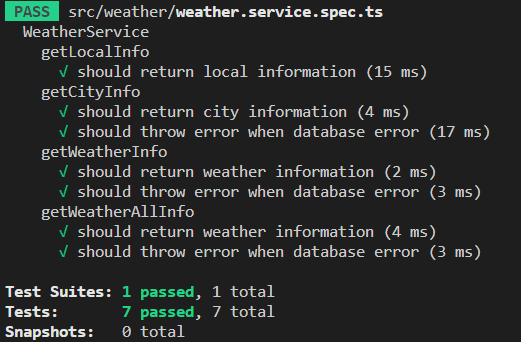

## 서론

저번 게시글에 이어서 날씨 정보를 받아오는 추가적인 기능을 만들어보자.  

## 1단계 : 기능의 요구사항 및 스팩

저번 게시글에서 만든 기능은 지역코드, 시간, 날짜 를 보내면 그에 맞는 데이터를 반환하는 것이었다.  
오늘은 시간과 날짜만 받아서 그것에 해당하는 전체 지역 데이터를 보내는 코드를 테스트를 이용해 만들어보자.  

이 기능의 요구사항 및 스팩은 아래와 같다.  

1. 클라이언트로부터 시간과 날짜 데이터를 요청받으면 해당 시간과 날짜에 해당하는 전체지역의 데이터를 반환하는 'getAllWeatherInfo' 를 구현한다.  

2. 클라이언트로부터 받은 데이터는 {date:string, time:number} 의 형태이다.  

4. 반환하는 데이터형태는 [temperature:number, precipitation:number, precipitationPattern:number, windSpeed:number, windDirection:number, humidity:number] 와 같아야한다.  

## 2단계 : 테스트 코드 작성

기능의 요구사항 및 스팩을 만족하는 테스트 코드를 작성하려면 아래와 같은 점을 고려해야한다.  

1. 클라이언트로부터 받을 데이터를 예제 데이터로 만든다.  

2. 'getAllWeatherInfo'가 반환하는 값을 예제 데이터로 만든다.  

클라이언트로 부터 받은 데이터는 Dto를 이용해 옮길 것임으로 Dto를 추가로 만들어준다.  

```typescript
import { IsNotEmpty, IsNumber, IsString } from 'class-validator';

export class SelectWeatherDto {
  @IsNotEmpty()
  @IsNumber()
  area: number;

  @IsNotEmpty()
  @IsNumber()
  time: number;

  @IsNotEmpty()
  @IsString()
  date: string;
}

export class SelectAllWeatherDto {
  @IsNotEmpty()
  @IsNumber()
  time: number;

  @IsNotEmpty()
  @IsString()
  date: string;
}
```
저번 게시글에서 사용했던 DTO도 추가로 작성해뒀으니 참고바란다.  

우선 해당 DTO를 모듈로 Import 한다.  

```typescript
import { SelectWeatherDto, SelectAllWeatherDto } from './dto/weather.dto';
```

각자 DTO위치에 맞게 경로를 수정하자.  
그리고 테스트 코드를 작성해보자.  
모듈에 사용이 예상되는 weatherRepository의 메소드인 find를 추가해준다.  

```typescript
beforeEach(async () => {
    const module: TestingModule = await Test.createTestingModule({
      providers: [
        WeatherService,
        {
          provide: getRepositoryToken(localEntity),
          useValue: {
            find: jest.fn(),
            createQueryBuilder: jest.fn(),
          },
        },
        {
          provide: getRepositoryToken(weatherEntity),
          useValue: {
            findOne: jest.fn(),
            find: jest.fn(),
          },
        },
      ],
    }).compile();

    service = module.get<WeatherService>(WeatherService);
    localRepository = module.get<Repository<localEntity>>(
      getRepositoryToken(localEntity),
    );
    weatherRepository = module.get<Repository<weatherEntity>>(
      getRepositoryToken(weatherEntity),
    );
  });
```

정상적인 작동을 테스트하는 테스트코드를 작성해보겠다.  

```typescript
  describe('getWeatherAllInfo', () => {
    it('should return weather information', async () => {
      const clientData: SelectAllWeatherDto = {
        date: '20230302',
        time: 15,
      };
      const returnWeatherInfo: weatherEntity[] = [
        {
          id: 1,
          area: 1,
          time: clientData.time,
          date: clientData.date,
          temperature: 12,
          precipitation: 0,
          precipitationPattern: 0,
          windSpeed: 0.2,
          windDirection: 340,
          humidity: 40,
        },
        {
          id: 2,
          area: 2,
          time: clientData.time,
          date: clientData.date,
          temperature: 15,
          precipitation: 0,
          precipitationPattern: 0,
          windSpeed: 1.4,
          windDirection: 150,
          humidity: 35,
        },
        {
          id: 3,
          area: 3,
          time: clientData.time,
          date: clientData.date,
          temperature: 7,
          precipitation: 50,
          precipitationPattern: 3,
          windSpeed: 2.3,
          windDirection: 280,
          humidity: 60,
        }
      ]
      jest
        .spyOn(weatherRepository, 'find')
        .mockResolvedValue(returnWeatherInfo);

      const weatherInfo = await service.getAllWeatherInfo(clientData);

      expect(weatherInfo).toEqual(returnWeatherInfo);
      expect(weatherRepository.find).toHaveBeenCalled();
    });
  });
```

우선 'selectAllWeatherDto' 형태의 Dto를 클라이언트로 요청받은 예시데이터를 작성한다.  
그리고 반환할 예시 데이터를 weatherEntity[] 의 객체 배열 형태로 작성한다.  
실제코드에서 사용이 예상되는 find 메소드를 mock 하고 'returnWeatherInfo' 가 반환되도록 설정했다.  
그 후 'getAllWeatherInfo' 를 호출해 'clientData' 를 매개변수로 받고 반환되는 값이 'returnWeatherInfo' 와 같은지를 테스트한다.  
또한 weatherRepository의 find 메소드가 제대로 호출되었는지 테스트한다.  

이제 데이터베이스 오류를 테스트하는 코드를 작성해보자.  

```typescript
    it('should throw error when database error', async () => {
      const clientData: SelectAllWeatherDto = {
        date: '20230302',
        time: 15,
      };

      jest.spyOn(weatherRepository, 'find').mockRejectedValue(new Error('Database error')),

        await expect(service.getAllWeatherInfo(clientData)).rejects.toThrow(
          new Error('Database error'),
        );
    });
```

똑같이 clientData 를 매개변수로 받는다.  
그리고 find 메소드가 호출되었을때 'Database error' 라는 예외가 발생하도록한다.  
'getAllWeatherInfo' 메소드를 호출하여 예외가 제대로 발생하고 err 코드를 제대로 반환했는지 테스트한다.  

## 3단계 : 테스트 실패 확인

당연히 실제 코드가 없으니 테스트는 실패한다.  

## 4단계 : 코드 작성

이제 테스트 코드를 바탕으로 실제 코드를 작성해보자.  

```typescript
  async getAllWeatherInfo(
    selectWeatherDto: SelectAllWeatherDto,
  ): Promise<weatherEntity[]> {
    try {
      return this.weatherRepository.find(selectWeatherDto);
    } catch (err) {
      throw err;
    }
  }
```

typeOrm의 find 메소드를 이용해 클라이언트로 부터 요청받은 데이터에 맞는 데이터를 찾아 반환하는 코드이다.  
예외가 발생하면 에러코드를 throw 한다.  
weatherEntity[] 형태의 객체 배열을 반환하고 매개변수로는 SelectAllWeatherDto 의 Dto를 받는다.  

## 5단계 : 테스트 통과 확인

<center></center>

테스트를 통과했다.  

## 6단계 : 리팩토링

리팩토링할 부분이 발견되지 않아 6단계는 패스한다.  

## 7단계 : 2~6단계 반복

기능의 요구사항 및 스팩을 모두 만족했기때문에 7단계는 패스한다.  