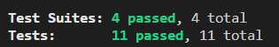

## 서론

이제 목표하는 기능은 대부분 만들었다.  
두개의 게시물에 거쳐서 컨트롤러 레이어를 완성하고 이 프로젝트는 마무리하도록 하겠다.  

## 1단계 : 기능의 요구사항 및 스팩

오늘 만들어볼 기능은 날씨 관련 기능의 컨트롤러들이다.  
이 기능의 요구사항 및 스팩은 아래와 같다.  

1. 서비스레이어의 'getWeatherInfo' 를 호출하는 'getWeatherInfo' 메소드를 구현해야한다.  

2. 'getWeatherInfo' 메소드는 SelectWeatherDto 형태의 매개변수를 받고 WeatherEntity 형태의 데이터를 반환한다.  

3. 서비스 레이어의 'getAllWeatherInfo' 를 호출하는 'getAllWeatherInfo' 메소드를 구현해야한다.  

4. 'getAllWeatherInfo' 메소드는 SelectAllWeatherDto 형태의 매개변수를 받고 WeatherEntity[] 형태의 데이터를 반환한다.  

## 2단계 : 테스트 코드 작성

위의 요구사항 및 스팩을 만족하기 위한 요소로는 아래가 필요하다.  

우선 'getWeathInfo' 은 아래와 같다.  

1. SelectWeatherDto 형태의 clientData  

2. WeatherEntity 형태의 반환값  

3. 반환값이 올바르게 반환되었는지 테스트  

4. 서비스레이어의 'getWeatherInfo' 가 호출되었는지 테스트  

```typescript
  describe('getWeatherInfo', () => {
    it('should return weather information', async () => {
      const clientData: SelectWeatherDto = {
        area: 11,
        date: '20230302',
        time: 15,
      };
      const returnWeatherInfo: WeatherEntity =
      {
        id: 1,
        area: clientData.area,
        time: clientData.time,
        date: clientData.date,
        temperature: 12,
        precipitation: 0,
        precipitationPattern: 0,
        windSpeed: 0.2,
        windDirection: 340,
        humidity: 40,
      };
      jest.spyOn(service, 'getWeatherInfo').mockResolvedValue(returnWeatherInfo);

      const WeatherInfo = await controller.getWeatherInfo(clientData);

      expect(WeatherInfo).toEqual(returnWeatherInfo);
      expect(service.getWeatherInfo).toHaveBeenCalled();
    })
  });
```

SelectWeatherDto 형태의 clientData를 임의로 만든다.  
그리고 WeatherEntity 형태의 반환값을 임의로 만든다.  
서비스레이어의 'getWeatherInfo' 메소드가 'returnWeaherINfo' 값을 반환하도록 Mock 한다.  
'returnWeatherInfo' 값이 제대로 반환되는지 테스트하고 서비스레어의 'getWeatherInfo' 값이 제대로 호출되었는지 또한 테스트한다.  

이제 'getAllWeatherInfo' 메소드의 테스트 코드를 만들어보자.  

1. SelectAllWeatherDto 형태를 가진 clientData  

2. WeatherEntity[] 형태를 가진 returnWeatherInfo  

3. returnWeatherInfo 값이 제대로 반환되었는지 테스트  

4. 서비스레이어의 getAllWeatherInfo 가 호출되었는지 테스트  

```typescript
  describe('getAllWeatherInfo', () => {
    it('should return weather information', async () => {
      const clientData: SelectAllWeatherDto = {
        date: '20230302',
        time: 15,
      };
      const returnWeatherInfo: WeatherEntity[] = [
        {
          id: 1,
          area: 1,
          time: clientData.time,
          date: clientData.date,
          temperature: 12,
          precipitation: 0,
          precipitationPattern: 0,
          windSpeed: 0.2,
          windDirection: 340,
          humidity: 40,
        },
        {
          id: 2,
          area: 2,
          time: clientData.time,
          date: clientData.date,
          temperature: 15,
          precipitation: 0,
          precipitationPattern: 0,
          windSpeed: 1.4,
          windDirection: 150,
          humidity: 35,
        },
        {
          id: 3,
          area: 3,
          time: clientData.time,
          date: clientData.date,
          temperature: 7,
          precipitation: 50,
          precipitationPattern: 3,
          windSpeed: 2.3,
          windDirection: 280,
          humidity: 60,
        }
      ]
      jest.spyOn(service, 'getAllWeatherInfo').mockResolvedValue(returnWeatherInfo);

      const WeatherInfo = await controller.getAllWeatherInfo(clientData);

      expect(WeatherInfo).toEqual(returnWeatherInfo);
      expect(service.getAllWeatherInfo).toHaveBeenCalled();
    })
  });
```

SelectAllWeatherDto 형태를 가진 임의의 값 clientData를 만든다.  
WeatherEntity[] 형태를 가진 임의의 값 retrunWeatherInfo 를 만든다.  
returnWeatherInfo 값이 제대로 반환되었는지 테스트한다.  
서비스레이어의 getAllWeatherInfo 메소드가 제대로 호출되었는지 테스트한다.  

## 3단계 : 테스트 실패 확인

실제 코드가 없으니 테스트는 실패한다.  

## 4단계 : 코드 작성

테스트 코드를 기반으로 실제 코드를 만들어보자.  

```typescript
  @Post()
  @UsePipes(ValidationPipe)
  async getWeatherInfo(
    @Body() selectWeatherDto: SelectWeatherDto,
  ): Promise<WeatherEntity> {
    const weatherInfo: WeatherEntity = await this.weatherService.getWeatherInfo(selectWeatherDto);
    return weatherInfo;
  }
```

위는 'getWeatherInfo' 메소드를 실제 코드로 작성해본 것이다.  
우선 Dto를 사용하기때문에 UsePipes를 이용해 클라이언트로부터 받은 값이 Dto의 형태를 갖추었는지 확인한다.  
매개변수로 Body 값을 Dto 형태의 객체로 받는다.  
서비스레이어의 getWeatherInfo의 매개변수로 Dto를 넘긴 뒤 반환 된 값을 weatherInfo에 할당한다.  
사용자에게 weatherInfo를 반환한다.  

```typescript
  @Post('/all')
  @UsePipes(ValidationPipe)
  async getAllWeatherInfo(
    @Body() selectWeatherDto: SelectAllWeatherDto,
  ): Promise<WeatherEntity[]> {
    const weatherInfo: WeatherEntity[] = await this.weatherService.getAllWeatherInfo(selectWeatherDto);
    return weatherInfo;
  }
```

위는 'getAllWeatherInfo' 메소드이다.  
똑같이 Dto를 사용하기 위해 UserPipes 를 사용한다.  
그리고 Body 값을 Dto 형태로 받는다.  
서비스레이어의 'getAllWeatherInfo' 메소드를 매개변수로 Dto를 넘기고 값을 반환받아 weatherInfo에 할당한다.  
사용자에게 weatherInfo를 반환한다.  

## 5단계 : 테스트 통과 확인

<center></center>

테스트를 통과했다.  

## 6단계 : 리팩토링

리팩토링할 부분이 발견되지 않아 6단계는 패스한다.  

## 7단계 : 2~6단계 반복

기능의 요구사항 및 스팩을 모두 만족했기때문에 7단계는 패스한다.  