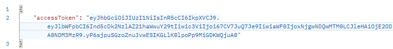

## 서론

저번 게시글에서는 JWT 세팅까지 해보았다.  
이번에는 JWT를 실제로 발급받아보자.  

## JWT 발급

JWT 발급을 받기 위해서는 우선 사용자 정보가 옯바른지 확인해야한다.  

```typescript
    async validateUser(loginDto: LoginDto): Promise<User | null> {
        const user = await this.userRepository.findOne({ where: { email: loginDto.email } });

        if (user) {
            if ((await this.comparePasswords(loginDto.password, user.password))) {
                return user;
            }
        }

        return null;
    }
```

위의 코드로 사용자 이메일과 비밀번호가 올바른지 확인한다.  

그리고 아래 코드를 통해 토큰을 발급한다.  

```typescript
    async login(user: User): Promise<JwtTokenDto> {
        const payload: Payload = { email: user.email, sub: user.name };
        const accessToken: JwtTokenDto = {
            accessToken: this.jwtService.sign(
                payload,
            ),
        };
        return accessToken;
    }
```
그리고 해당 코드를 실행시킬 컨트롤러 코드도 작성한다.  

```typescript
    @Post('login')
    @UsePipes(ValidationPipe)
    async login(
        @Body() loginDto: LoginDto
    ): Promise<object> {
        const user: User | string = await this.authService.validateUser(loginDto);
        if (!user) {
            throw new UnauthorizedException('Invalid email or password');
        }
        if (user.is_authed !== 1) {
            throw new UnauthorizedException('Not Authorization');
        }

        return this.authService.login(user);
    };
```

위의 코드를 실행시키면 아래와 같이 코드를 반환한다.  

<center></center>

## 마치며

오늘은 토큰을 발급받아 보았다.  
다음 게시글에서는 발급받은 토큰을 어떻게 이용하는지 알아보자.  