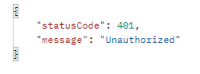

## 서론

JWT 토큰을 발급받아 보았으니 이번에는 발급받은 토큰을 통해 인증받는 방법에 대해서 알아보자.  

## 본론

우선 토큰을 인증 받으려면 패스포트에 가드라는 것을 이용해야한다.  

가드를 사용할 모듈에 아래 코드를 imports 해준다

```
imports: [
        PassportModule.register({
          defaultStrategy: 'jwt',
          session: false
      })
]
```

그리고 인증 토큰을 사용해야하는 컨트롤러 코드에 아래와 같은 데코레이터를 추가해준다.  

```typescript
    @Get('')
    @UseGuards(JwtAuthGuard)
    async getUserData(@Req() request): Promise<User> {
        return request.user
    }
```

@UseGuards 를 이용하면 헤더 있는 토큰이 유효한 토큰인지 인식해준다.  

헤더에는 다음과 같은 형식으로 들어가야한다.  
Key = Authorization , Value = Bearer (JWT토큰)  

위와 같은 헤더를 추가해 요청하면 제대로된 데이터가 반환된다.  
헤더에 있는 토큰이 유효한 값이 아니라면 아래와 같이 인증되지 않았다는 메세지가 반환된다.  

<center></center>

## 마치며

오늘은 발급받은 JWT로 서비스를 이용하기 위해 인증해야하는 방식을 구현해보았다.  
JWT를 이용하면 인증받은 사용자만 서비스를 이용할 수 있으니 알아두면 좋을 것 같다.  