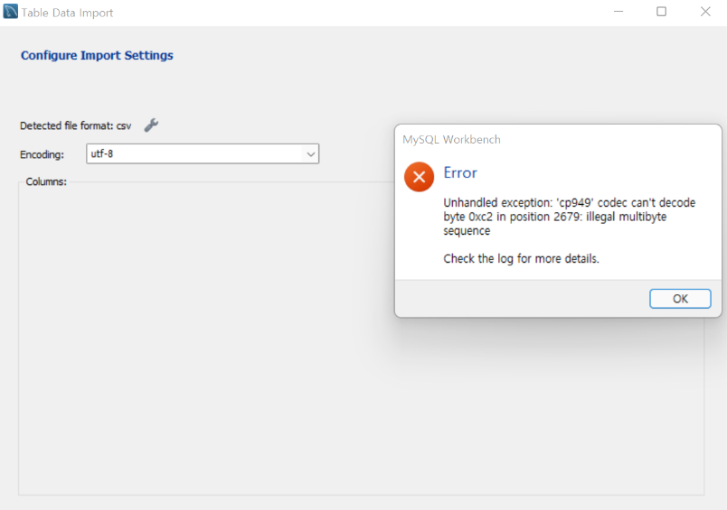
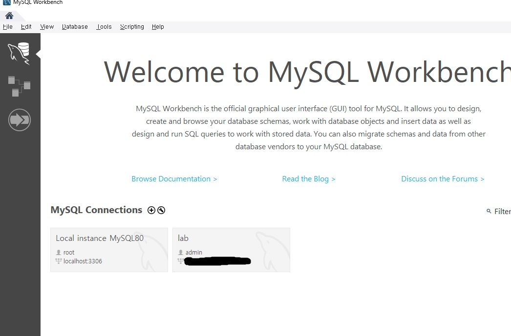

## 서론

Mysql에서 csv파일을 테이블에 추가하려고할 때 오류가 발생했다.  
오류를 해결하는 과정을 글로 적어보았다.  

## 오류

Mysql Workbench를 이용해 csv 파일을 테이블에 추가하려고 했다.  
하지만 아래와 같은 오류가 발생했다.  

<center></center>

대충보기에는 utf-8 인코딩에 cp949 인코딩이 맞지 않는다는 내용으로보인다.  
그래서 여러가지 방법을 시도해 보았다.  

## 파일 수정

csv파일을 메모장으로 연 뒤 다른이름으로 저장하여 인코딩을 UTF-8 로 설정해주었다.  
하지만 여전히 오류가 발생했다.  

## 쿼리문으로 파일 추가

```
LOAD DATA LOCAL INFILE "C:/test/test.csv"
INTO TABLE test.tablename
FIELDS TERMINATED BY "," 
LINES TERMINATED BY "\n"
IGNORE 1 ROWS;
```

위의 쿼리문으로 파일을 추가하려고 했지만 또 다른 오류가 발생했다.  

```
Loading local data is disabled; this must be enabled on both the client and server sides
```

이 오류는 아래의 쿼리문을 실행해주면 해결된다.  

```
set global local_infile=1;
```

위의 쿼리문을 실행한 뒤 다시 추가하는 쿼리문을 실행시키면 제대로 추가가 되는 것을 알 수 있다.  

## WorkBench에서 오류 발생

위의 쿼리문을 mysql 커맨드창에서하면 괜찮지만 워크벤치에서 쿼리문을 실행시키면 안되는 경우가 있다.  
그럴경우 워크벤치 시작화면에서 세팅을 해주어야한다.  

<center></center>

시작화면에서 원하는 연결에서 오른쪽 마우스를 클릭한다.  
Edit Connection 을 선택한다.  

<center></center>

Connection탭에 Advanced탭을 선택하고 Others에 아래의 내용을 추가한다.  

```
OPT_LOCAL_INFILE=1
```

그러고나서 쿼리문을 실행하면 제대로 실행되는 것을 알 수 있다.  

