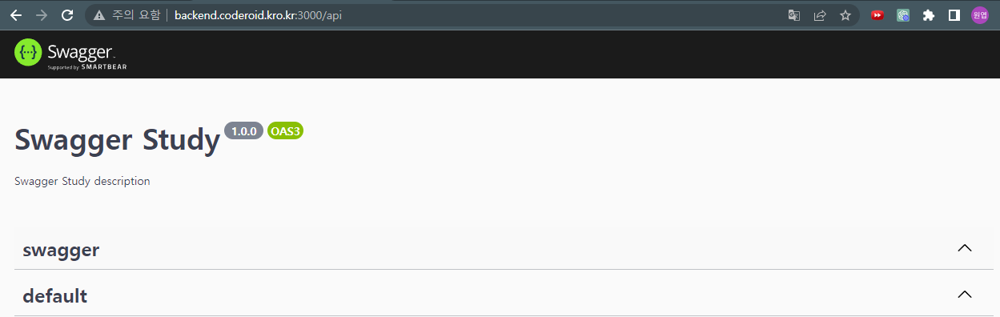
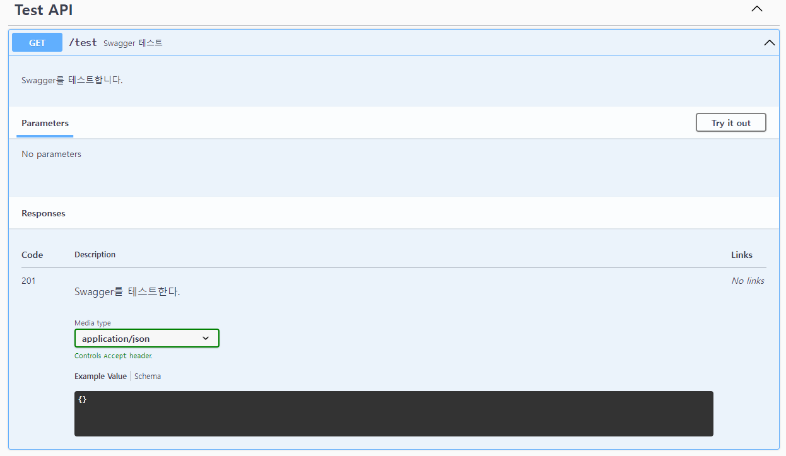
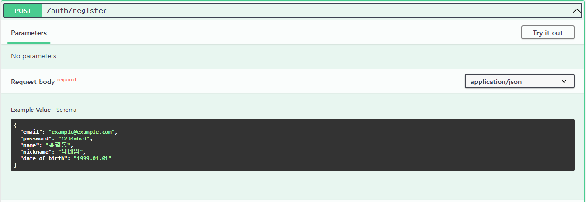
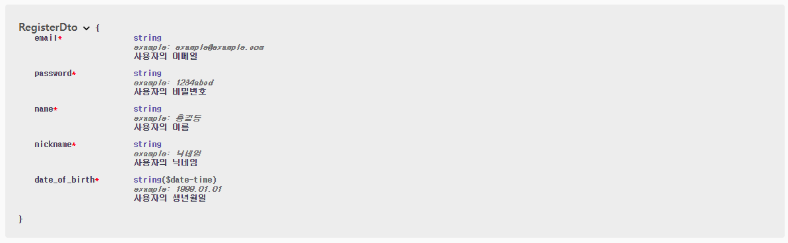

## 서론

RestAPI를 만들고나서 이를 사용자가 사용하기 위해서는 설명서가 필요하다.  
이를 위해 API 문서를 작성하는 경우가 많은데 그때 사용하는 도구 중 하나가 Swagger이다.  
오늘은 Swagger에 대해서 알아보자.  

## Swagger란?

Swagger는 RestFul API를 설계하고, 문서화하는데 많은 도움을 주는 프레임워크이다.  
이는 프론트엔드 개발자와 백엔드 개발자가 각자의 작업에 집중하게 해주며, API의 사용자들에게 명확한 정보를 제공해준다.  
또한 API문서를 자동으로 작성해주기때문에 따로 문서를 작성할 필요없이 코드를 수정하면서 동시에 API 문서를 작성할 수 있는 것이 큰 장점이다.  
이는 API문서가 항상 최신상태를 유지하고 있는 것을 의미하므로 팀원들 또는 사용자들이 항상 최신 상태의 API 문서를 볼 수 있다는 장점도 있다.  

## NestJS에서 Swagger 설치

Swagger를 사용하기 위해서는 아래 명령을 이용해서 Swagger를 설치하면 된다.  

```
npm install --save @nestjs/swagger swagger-ui-express
```

## NestJS에서 Swagger 사용해보기

모듈을 설치했다면 main.ts에서 SwaggerModule을 세팅하여 사용한다.  

```typescript
import { NestFactory } from '@nestjs/core';
import { AppModule } from './app.module';
import { DocumentBuilder, SwaggerModule } from '@nestjs/swagger';

async function bootstrap() {
  const app = await NestFactory.create(AppModule);
  const config = new DocumentBuilder()
    .setTitle('Swagger Study')
    .setDescription('Swagger Study description')
    .setVersion('1.0.0')
    .addTag('swagger')
    .build();

  const document = SwaggerModule.createDocument(app, config);

  SwaggerModule.setup('api', app, document);
  await app.listen(3000);
}
bootstrap();
```

DocumentBuilder() 메소드와 그 아래 속성들을 이용해 API문서의 기본 세팅 작성해준다.  
그리고 SwaggerModule의 createDocument() 를 이용하여 문서를 세팅해준다.  
또한 SwaggerModule의 setup() 을 이용하여 실제 문서를 구축한다.  
setup()에서 'api' 는 문서의 주소를 의미하므로 localhost:3000/api 로 이동하면 만들어진 문서를 볼 수 있다.  

위의 설정을 작성한 뒤 서버를 켜고 문서의 주소로 들어가면 아래와 같은 사이트가 나온다.  

<center></center>

이제 API를 문서화 해보자.  
Swagger에서는 데코레이터를 이용해 API를 문서화 한다.  

```typescript
import { Controller, Get } from '@nestjs/common';
import { AppService } from './app.service';
import { ApiCreatedResponse, ApiOperation, ApiTags } from '@nestjs/swagger';

@Controller()
@ApiTags('Test API')
export class AppController {
  constructor(private readonly appService: AppService) { }

  @Get('/test')
  @ApiOperation({ summary: 'Swagger 테스트', description: 'Swagger를 테스트합니다.' })
  @ApiCreatedResponse({ description: 'Swagger를 테스트한다.', type: Object })
  async test() {
    return { response: 'hello' };
  }
}
```
@ApiTags() 를 이용해 문서내에서 태그를 나눌 수 있다.  
@ApiOperation() 에서는 API의 제목과 설명을 설정한다.  
@ApiCreatedResponse() 는 API가 어떤 응답을 하는지 알려준다.  

위의 코드와 같이 작성하고 문서에 들어가보면 아래와 같이 되어있다.  

<center></center>

Swagger는 DTO에 관한 내용도 설정이 가능하다.  

```typescript
export class RegisterDto {
    @ApiProperty({
        example: 'example@example.com',
        description: '사용자의 이메일',
    })
    @IsNotEmpty()
    @IsString()
    email: string;

    @ApiProperty({
        example: '1234abcd',
        description: '사용자의 비밀번호',
    })
    @IsNotEmpty()
    @IsString()
    password: string;

    @ApiProperty({
        example: '홍길동',
        description: '사용자의 이름',
    })
    @IsNotEmpty()
    @IsString()
    name: string;

    @ApiProperty({
        example: '닉네임',
        description: '사용자의 닉네임',
    })
    @IsNotEmpty()
    @IsString()
    nickname: string;

    @ApiProperty({
        example: '1999.01.01',
        description: '사용자의 생년월일',
    })
    @IsNotEmpty()
    @Type(() => Date)
    @IsDate()
    date_of_birth: Date;
}
```
@ApiProperty()를 이용해 값의 예시와 설명을 적어줄 수 있다.  
위와 같이 코드를 작성하면 해당 DTO를 사용하는 API에 데이터에 대한 설명과 예시가 적히고, 또한 DTO를 따로 볼 수도 있다.  

<center></center>
  
<center></center>

## 마치며

API문서를 작성하는 것은 사용자가 API를 사용함에 있어 혼란을 주지 않고 개발에만 집중할 수 있다.  
그렇기때문에 API 문서를 정확하게 쓰고, 항상 최신상태를 유지하는 것은 중요하다.  
그러한점에서 Swagger는 많은 도움이 될 것이다.  
