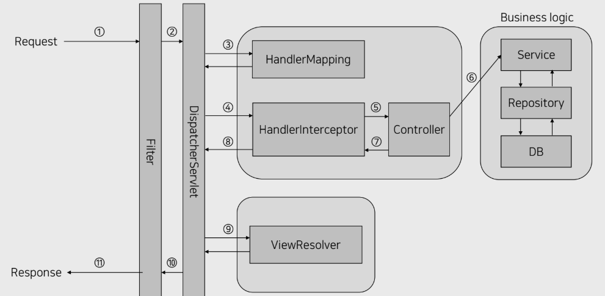

## 서론

Spring Boot 프레임워크를 사용하기전 알아야하는 필수적인 개념들이 몇가지가 있다.  
Jpa, Bean 등 필수적으로 알아야하는 개념 중 Spring boot request life cycle에 대해서 알아보자.  

## Spring boot request life cycle

Spring 프레임워크를 효과적으로 사용하려면 이 개념에 대해서 이해하는 것이 중요하다.  
Spring boot reqeust life cycle은 Spring Boot에서의 Http요청에 대한 수명 주기에 대한 과정이다.  

## Life Cycle

### 1. 클라이언트가 HTTP 요청을 보낸다

클라이언트(브라우저, 모바일 앱 등)가 HTTP 요청을 보낸다.  

### 2. DispatcherServlet이 요청을 수신한다.  

DispatcherServlet은 Reqeust에 대해 어느 컨트롤러로 매핑시킬 것인지를 정하는 역할을 한다.  
들어오는 모든 요청을 우선적으로 받아 처리해주는 Servlet이다.  

### 3. HandlerMapping이 컨트롤러를 결정한다.  

DispatcherServlet이 요청을 수신한 하고 HandlerMapping에게 Request에 대해 매핑할 Controller를 요청한다.  
그 후 적절한 Controller와 요청을 매핑시킨다.  
HandlerInterceptor를 이용해 Request가 Controller에 매핑되기 전 앞단에서 부가적인 로직을 끼워 넣는다.

### 4. Controller가 요청을 처리한다.  

Request와 매핑 된 Controller는 어떤 로직으로 처리할 것인지를 결정하고, 그에 맞는 Service를 호출한다.  
Service Bean은 스프링 컨테이너로부터 주입받아야한다.  

### 5. Service를 호출하고 데이터 상호작용

컨트롤러가 데이터베이스와 상호 작용해야 하는 경우 DAO(Data Acess Object) 또는 Repository를 사용하여 데이터를 가져오거나 유지하는 서비스를 통해 이러한 작업을 수행한다.  

### 6. Controller는 Model과 View를 반환한다.  

Controller가 로직을 실행하면 Model과 View를 반환한다.  

### 7. ViewResolver가 View를 렌더링한다.  

Controller에서 리턴한 View의 이름을 DispatcherServlet으로 부터 넘겨받고, 해당 View를 렌더링한다.  
렌더링한 View는 DispatcherServlet으로 반환하고, DispatcherServlet에서는 해당 View 화면을 Response 한다.  

## 마치며

Spring Boot를 사용하기 전 알아야하는 개념이 많다.  
특히 Spring Boot Request Life Cycle은 필수적으로 이해해야하는 개념 중 하나이다. 
Life Cycle을 이해하는 것으로 Request를 효율적으로 처리하고, 잘 구조화되고 유지 보수에 용이한 코드를 작성할 수 있다.  
