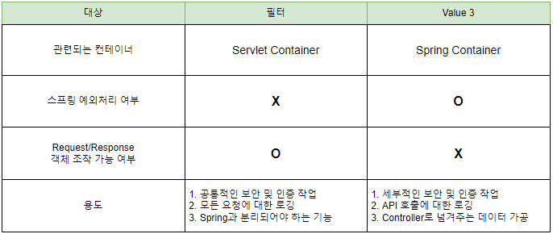

## 서론

서버에서 요청을 처리하기 전과 후로 작업을 공통적으로 처리해줘야하는 경우가 있다.  
그럴때 사용할 수 있는 기능이 필터와 인터셉터이다.  

## Filter

필터는 J2EE 표준 스펙 기능 중 하나이다.  
J2EE란 자바 기술로 기업 환경의 어플리케이션을 만드는데 필요한 스펙을을 모아둔 스펙 집합을 말한다.  

필터는 디스패처 서블릿(Dispatcher Servlet)에 요청이 전달되기 전과 후에 url패턴에 맞는 모든 요청에 대한 부가적인 작업을 처리할 수 있는 기능을 말한다.  
디스패처 서블릿은 HTTP 프로토콜로 들어오는 모든 요청을 가장 먼저 받아 적합한 컨트롤러에 위임해주는 프론트 컨트롤러이다.  
즉, 가장 앞에 존재하는 컨트롤러에 전달되기 전과 후에 작업을 처리하는 것이므로 필터는 Spring 프레임워크 범위 밖에서 처리된다.  

용도로는 공통적인 보안 및 인증작업, 모든 요청에 대한 로깅을 할때 사용된다.  
대표적으로 Spring Security는 Spring MVC에 종속적이지 않은데 그 이유가 필터를 통해 인증 및 인가 처리를 하기 때문이다.  

## Interceptor

인터셉터는 Spring 프레임워크 자체에서 제공하는 기술로 디스패처 서블릿이 컨트롤러를 호출하기 전과 후에 요청과 응답에 대한 부가적인 작업을 처리할 수 있는 기능이다.  
필터와 달리 Spring 내부에서 처리된다.  

용도로는 세부적인 보안 및 인증작업, API 호출에 대한 로깅, Controller로 넘겨주는 데이터의 가공에 사용된다.  

## Filter vs Interceptor

